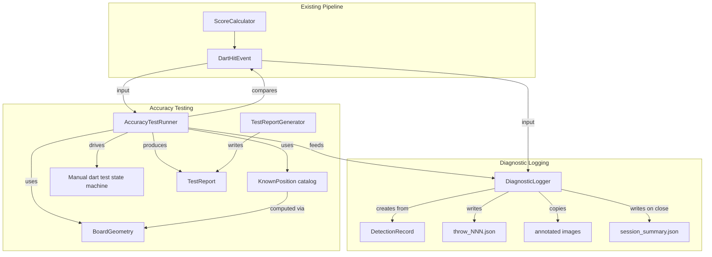

# Design Document: Scoring Diagnostics

## Overview

The scoring diagnostics feature adds two capabilities to the ARU-DART system:

1. **Diagnostic logging** — a `DiagnosticLogger` that captures the full pipeline state for every dart detection (per-camera pixel/board coords, fusion result, polar coords, ring/sector classification, per-camera deviation) and persists it as structured JSON plus annotated images, organized by session.

2. **Accuracy test mode** — an `AccuracyTestRunner` that guides the user through placing darts at known board positions (e.g. T20, D5, SB), compares detected results against expected values, and produces a `TestReport` with quantifiable accuracy metrics (sector/ring/score match rates, mean/max position error, per-camera deviation stats).

Both capabilities build on the existing `DartHitEvent` dataclass and `ScoreCalculator` pipeline — they consume pipeline output rather than duplicating it.

### Key Design Decisions

- **Detection_Record wraps DartHitEvent**: The diagnostic record is constructed from an existing `DartHitEvent` plus computed camera deviations, not by re-running the pipeline.
- **Known positions computed from geometry**: Expected board coordinates use `BoardGeometry.get_board_coords()` (center of ring at sector angle), not hardcoded x/y values. This also covers `SB` (single bull) and `DB` (double bull) via the bull center.
- **Accuracy test reuses manual-dart-test state machine**: The `stabilize → placing → detecting → result → removing` cycle is reused, with an additional prompt overlay showing the target position.
- **`--diagnostics` is an add-on flag**: Works with `--manual-dart-test` or `--single-dart-test`. Errors if used alone.
- **`--accuracy-test` is standalone**: Implies diagnostics. Uses the manual-dart-test state machine internally.
- **Session directories**: `data/diagnostics/Session_NNN_YYYY-MM-DD_HH-MM-SS/` with sequential numbering.

## Architecture



### Module Layout

```
src/diagnostics/
    __init__.py
    detection_record.py    # DetectionRecord dataclass
    diagnostic_logger.py   # DiagnosticLogger (session management, JSON/image persistence)
    known_positions.py     # KnownPosition dataclass + catalog builder
    accuracy_test_runner.py # AccuracyTestRunner (orchestrates accuracy test workflow)
    test_report.py         # TestReport, TestReportGenerator
```

### Integration Points

- `main.py`: New CLI flags `--diagnostics` and `--accuracy-test`. When `--diagnostics` is active, a `DiagnosticLogger` is instantiated and called after each `ScoreCalculator.process_detections()` result. When `--accuracy-test` is active, `AccuracyTestRunner` takes over the main loop.
- `src/fusion/dart_hit_event.py`: Read-only dependency — `DetectionRecord` is built from `DartHitEvent`.
- `src/calibration/board_geometry.py`: Read-only dependency — `KnownPosition` catalog uses `get_board_coords()` and `get_sector_angle()`.

## Components and Interfaces

### DetectionRecord

Wraps a `DartHitEvent` with additional diagnostic fields (camera deviations).

```
DetectionRecord:
    # Inherited from DartHitEvent
    timestamp: str
    board_x, board_y: float          # fused position (mm)
    radius: float                     # polar radius (mm)
    angle_deg: float                  # polar angle (degrees)
    ring: str                         # ring classification
    sector: int | None                # sector number
    score_total: int                  # final score
    score_base: int
    score_multiplier: int
    fusion_confidence: float
    cameras_used: list[int]

    # Per-camera data
    camera_data: list[CameraDiagnostic]
        camera_id: int
        pixel_x, pixel_y: float      # raw pixel detection
        board_x, board_y: float      # mapped board coords
        confidence: float
        deviation_mm: float           # euclidean distance from fused position
        deviation_dx: float           # dx from fused to this camera's coords
        deviation_dy: float           # dy from fused to this camera's coords

    # Image references
    image_paths: dict[str, str]       # camera_id -> path

Methods:
    to_dict() -> dict                 # JSON-serializable
    from_dict(data) -> DetectionRecord  # round-trip deserialization
    from_dart_hit_event(event: DartHitEvent) -> DetectionRecord  # factory
```

The `from_dart_hit_event` factory computes camera deviations:

```
from_dart_hit_event(event):
    for each detection in event.detections:
        dx = detection.board_x - event.board_x
        dy = detection.board_y - event.board_y
        deviation_mm = sqrt(dx*dx + dy*dy)
        store CameraDiagnostic(camera_id, pixel, board, confidence, deviation_mm, dx, dy)
    return DetectionRecord(...)
```

### DiagnosticLogger

Manages a diagnostic session: creates the session directory, writes per-throw JSON and images, and produces a session summary on close.

```
DiagnosticLogger:
    __init__(base_dir="data/diagnostics"):
        create session directory: data/diagnostics/Session_NNN_YYYY-MM-DD_HH-MM-SS/
        throw_count = 0
        records = []

    log_detection(event: DartHitEvent) -> DetectionRecord:
        record = DetectionRecord.from_dart_hit_event(event)
        throw_count += 1
        write record.to_dict() as throw_NNN_HH-MM-SS.json
        copy annotated images into session dir
        records.append(record)
        return record

    write_session_summary():
        compute: total throws, successful detections, avg fusion confidence
        compute per-camera aggregates: mean/max deviation, mean deviation vector
        write session_summary.json

    session_dir: Path  (read-only property)
```

### KnownPosition

A target board position with expected coordinates and score.

```
KnownPosition:
    name: str                  # e.g. "T20", "SB", "DB", "BS5"
    expected_x: float          # board x (mm)
    expected_y: float          # board y (mm)
    expected_ring: str         # "triple", "double", "single", "bull", "single_bull"
    expected_sector: int|None  # 1-20 or None for bulls
    expected_score: int        # total score

build_known_positions(board_geometry: BoardGeometry) -> list[KnownPosition]:
    positions = []
    # DB (double bull) -> (0, 0), ring="bull", score=50
    # SB (single bull) -> center of single bull ring at 0 deg, ring="single_bull", score=25
    #   Actually SB is rotationally symmetric, use (0, single_bull_mid_radius)
    #   or just (0, 0) offset by mid-radius at an arbitrary angle.
    #   Per requirement: use BoardGeometry. SB center = (0, 0) is bull center,
    #   but single bull is a ring. Use angle=90deg (top) for SB target.
    # For each sector in [20, 1, 5]:
    #   T{s} -> board_geometry.get_board_coords(s, "triple")
    #   D{s} -> board_geometry.get_board_coords(s, "double")
    #   BS{s} -> board_geometry.get_board_coords(s, "single") [big single = outer single]
    #   SS{s} -> small single: midpoint of single_bull_radius and triple_inner at sector angle
    return positions
```

The SS (small single) positions need a custom radius since `BoardGeometry.get_board_coords` doesn't have a "small_single" ring type. The radius is `(single_bull_radius + triple_inner) / 2` at the sector angle.

### AccuracyTestRunner

Orchestrates the accuracy test workflow. Drives the manual-dart-test state machine, prompting the user for each known position.

```
AccuracyTestRunner:
    __init__(known_positions, diagnostic_logger, score_calculator, ...):
        self.positions = known_positions  # or filtered subset
        self.current_index = 0
        self.results = []  # list of per-throw comparison dicts

    get_current_target() -> KnownPosition | None:
        return positions[current_index] if not done

    record_result(event: DartHitEvent):
        target = get_current_target()
        record = diagnostic_logger.log_detection(event)

        # Compute comparison metrics
        position_error = sqrt((event.board_x - target.expected_x)^2 +
                              (event.board_y - target.expected_y)^2)
        angular_error = angle_difference(event.angle_deg, expected_angle_deg)
        ring_match = (event.score.ring == target.expected_ring)
        sector_match = (event.score.sector == target.expected_sector)
        score_match = (event.score.total == target.expected_score)

        results.append({target, detected, position_error, angular_error,
                        ring_match, sector_match, score_match, record})
        current_index += 1

    is_complete() -> bool:
        return current_index >= len(positions)
```

### TestReportGenerator

Aggregates per-throw results into a summary report.

```
TestReportGenerator:
    generate_report(results, diagnostic_logger) -> TestReport:
        overall:
            total_throws
            sector_match_rate = count(sector_match) / total * 100
            ring_match_rate = count(ring_match) / total * 100
            score_match_rate = count(score_match) / total * 100
            mean_position_error_mm
            max_position_error_mm

        per_throw_detail: list of {
            target_name, expected_score, detected_score,
            position_error_mm, angular_error_deg,
            ring_match, sector_match
        }

        per_camera: for each camera_id:
            mean_deviation_mm, max_deviation_mm

    TestReport:
        to_dict() -> dict
        from_dict(data) -> TestReport
        print_summary()  # human-readable console output
```

## Data Models

### DetectionRecord JSON Schema

```json
{
  "timestamp": "2025-01-15T10:30:00Z",
  "fused_position": { "x_mm": 0.5, "y_mm": 103.0 },
  "polar": { "radius_mm": 103.0, "angle_deg": 89.7 },
  "classification": { "ring": "triple", "sector": 20 },
  "score": { "base": 20, "multiplier": 3, "total": 60 },
  "fusion_confidence": 0.85,
  "cameras_used": [0, 1, 2],
  "camera_data": [
    {
      "camera_id": 0,
      "pixel": { "x": 412.0, "y": 198.0 },
      "board": { "x_mm": 1.2, "y_mm": 104.5 },
      "confidence": 0.9,
      "deviation_mm": 1.6,
      "deviation_vector": { "dx_mm": 0.7, "dy_mm": 1.5 }
    }
  ],
  "image_paths": { "0": "cam0_annotated.jpg" }
}
```

### Session Summary JSON Schema

```json
{
  "session_dir": "data/diagnostics/Session_001_2025-01-15_10-30-00",
  "total_throws": 14,
  "successful_detections": 13,
  "average_fusion_confidence": 0.82,
  "per_camera_stats": {
    "0": {
      "mean_deviation_mm": 3.2,
      "max_deviation_mm": 7.1,
      "mean_deviation_vector": { "dx_mm": 1.1, "dy_mm": -2.8 }
    }
  }
}
```

### TestReport JSON Schema

```json
{
  "session_dir": "data/diagnostics/Session_001_...",
  "overall": {
    "total_throws": 14,
    "sector_match_rate": 71.4,
    "ring_match_rate": 85.7,
    "score_match_rate": 64.3,
    "mean_position_error_mm": 8.5,
    "max_position_error_mm": 22.1
  },
  "per_throw": [
    {
      "target": "T20",
      "expected_score": 60,
      "detected_score": 60,
      "position_error_mm": 4.2,
      "angular_error_deg": 1.8,
      "ring_match": true,
      "sector_match": true
    }
  ],
  "per_camera": {
    "0": { "mean_deviation_mm": 3.2, "max_deviation_mm": 7.1 },
    "1": { "mean_deviation_mm": 2.8, "max_deviation_mm": 5.9 },
    "2": { "mean_deviation_mm": 5.1, "max_deviation_mm": 9.0 }
  }
}
```

### KnownPosition Catalog

The minimum required positions (from Requirement 4.1):

| Name | Ring | Sector | Radius (mm) | Score |
|------|------|--------|-------------|-------|
| DB   | bull | None   | 0.0         | 50    |
| SB   | single_bull | None | ~11.1 (mid of bull ring) | 25 |
| T20  | triple | 20   | 103.0 (mid triple) | 60 |
| T1   | triple | 1    | 103.0       | 3     |
| T5   | triple | 5    | 103.0       | 15    |
| D20  | double | 20   | 166.0 (mid double) | 40 |
| D1   | double | 1    | 166.0       | 2     |
| D5   | double | 5    | 166.0       | 10    |
| BS20 | single | 20   | 134.5 (mid big single) | 20 |
| BS1  | single | 1    | 134.5       | 1     |
| BS5  | single | 5    | 134.5       | 5     |
| SS20 | single | 20   | 57.45 (mid small single) | 20 |
| SS1  | single | 1    | 57.45       | 1     |
| SS5  | single | 5    | 57.45       | 5     |

Radii are computed as midpoints: triple = (99+107)/2 = 103, double = (162+170)/2 = 166, big single = (107+162)/2 = 134.5, small single = (15.9+99)/2 = 57.45. SB uses the midpoint of the single bull ring at an arbitrary angle (90° / top).


## Correctness Properties

*A property is a characteristic or behavior that should hold true across all valid executions of a system — essentially, a formal statement about what the system should do. Properties serve as the bridge between human-readable specifications and machine-verifiable correctness guarantees.*

### Property 1: DetectionRecord preserves DartHitEvent fields

*For any* valid `DartHitEvent` with N camera detections, the `DetectionRecord` created via `from_dart_hit_event()` should contain the same fused coordinates (board_x, board_y), the same polar coordinates (radius, angle_deg), the same classification (ring, sector), the same score (base, multiplier, total), the same fusion_confidence, the same cameras_used list, and N `CameraDiagnostic` entries whose camera_id, pixel coords, board coords, and confidence match the source detections.

**Validates: Requirements 1.1, 1.2, 1.3**

### Property 2: DetectionRecord JSON round-trip

*For any* valid `DetectionRecord`, serializing it with `to_dict()` and then deserializing with `from_dict()` should produce an equivalent `DetectionRecord` (all fields equal within floating-point tolerance).

**Validates: Requirements 1.4, 1.5**

### Property 3: Camera deviation vector consistency

*For any* `DetectionRecord` and *for any* camera diagnostic entry within it, the `deviation_mm` field should equal `sqrt(deviation_dx^2 + deviation_dy^2)` (within floating-point tolerance), and `deviation_dx` should equal `camera.board_x - fused_board_x`, and `deviation_dy` should equal `camera.board_y - fused_board_y`.

**Validates: Requirements 7.1, 7.2**

### Property 4: Session summary aggregation correctness

*For any* sequence of `DetectionRecord` objects logged to a `DiagnosticLogger`, the session summary should report `total_throws` equal to the count of records, `successful_detections` equal to the count of records with non-zero cameras_used, `average_fusion_confidence` equal to the mean of all records' fusion_confidence values, and per-camera mean/max deviation and mean deviation vector matching the values computed from the individual camera diagnostics across all records.

**Validates: Requirements 2.4, 7.3**

### Property 5: Known position coordinates match BoardGeometry

*For any* known position in the catalog that has a sector (i.e., not DB), the expected board coordinates should equal `BoardGeometry.get_board_coords(sector, ring_type)` for the appropriate ring type. For SS (small single) positions, the expected coordinates should use the midpoint radius `(single_bull_radius + triple_inner) / 2` at the sector angle from `BoardGeometry.get_sector_angle(sector)`.

**Validates: Requirements 4.2, 4.3**

### Property 6: Position error is Euclidean distance

*For any* two board positions (detected_x, detected_y) and (expected_x, expected_y), the computed position error should equal `sqrt((detected_x - expected_x)^2 + (detected_y - expected_y)^2)`.

**Validates: Requirements 5.4**

### Property 7: Angular error handles wraparound

*For any* two angles in [0, 360), the computed angular error should equal the minimum absolute angular difference, i.e., `min(|a - b|, 360 - |a - b|)`, and the result should always be in [0, 180].

**Validates: Requirements 5.5**

### Property 8: Report metric aggregation correctness

*For any* list of per-throw accuracy results, the `TestReport` overall metrics should satisfy: `sector_match_rate` equals `count(sector_match=True) / total_throws * 100`, `ring_match_rate` equals `count(ring_match=True) / total_throws * 100`, `score_match_rate` equals `count(score_match=True) / total_throws * 100`, `mean_position_error_mm` equals the arithmetic mean of all position errors, `max_position_error_mm` equals the maximum position error, and per-camera mean/max deviation matches the aggregation of camera deviations across all throws.

**Validates: Requirements 6.2, 6.3, 6.4**

### Property 9: TestReport JSON round-trip

*For any* valid `TestReport`, serializing it with `to_dict()` and then deserializing with `from_dict()` should produce an equivalent `TestReport` (all fields equal within floating-point tolerance).

**Validates: Requirements 6.6**

## Error Handling

- **No DartHitEvent produced**: If `ScoreCalculator.process_detections()` returns `None`, the `DiagnosticLogger` is not called for that throw. The throw is not counted in diagnostics.
- **Missing image files**: If `DartHitEvent.image_paths` references a file that doesn't exist, `DiagnosticLogger.log_detection()` logs a warning and skips the image copy. The JSON record is still written.
- **No cameras calibrated**: If no cameras have board coordinates (all `CameraDetection.board_x/board_y` are effectively absent), the `DetectionRecord` will have empty `camera_data`. The session summary still counts the throw.
- **Empty accuracy test session**: If the user quits before completing any throws, `TestReportGenerator` produces a report with zero throws and N/A metrics. No division-by-zero errors.
- **Filesystem errors**: If the session directory cannot be created (permissions, disk full), `DiagnosticLogger.__init__` raises an exception with a clear message. The test mode should catch this and exit gracefully.
- **`--diagnostics` without test mode**: `main.py` argument validation detects this combination and prints an error message, then exits with a non-zero code before initializing any cameras.
- **Accuracy test with no calibrated cameras**: The system warns at startup but proceeds — detections will likely fail fusion, and the report will show 0% match rates, which is useful diagnostic information in itself.

## Testing Strategy

### Unit Tests

Unit tests cover specific examples and edge cases:

- **DetectionRecord creation**: Create a `DartHitEvent` with known values, verify `DetectionRecord.from_dart_hit_event()` produces correct fields.
- **Known position catalog**: Verify the catalog contains all 14 required positions (DB, SB, T20, T1, T5, D20, D1, D5, BS20, BS1, BS5, SS20, SS1, SS5).
- **Angular error edge cases**: Test wraparound at 0/360 boundary (e.g., angles 1° and 359° should give error of 2°).
- **Session summary with zero throws**: Verify no division-by-zero, produces valid JSON.
- **CLI validation**: `--diagnostics` without `--manual-dart-test` or `--single-dart-test` should error.
- **Report with all matches**: 100% match rates computed correctly.
- **Report with no matches**: 0% match rates computed correctly.

### Property-Based Tests

Property-based tests use the `hypothesis` library (already used in the project) with a minimum of 100 iterations per test. Each test references its design property.

- **Property 1 test**: Generate random `DartHitEvent` objects (random coords, scores, 1-3 camera detections), create `DetectionRecord`, verify field preservation.
  Tag: `Feature: scoring-diagnostics, Property 1: DetectionRecord preserves DartHitEvent fields`

- **Property 2 test**: Generate random `DetectionRecord` objects, round-trip through `to_dict()`/`from_dict()`, verify equivalence.
  Tag: `Feature: scoring-diagnostics, Property 2: DetectionRecord JSON round-trip`

- **Property 3 test**: Generate random fused positions and camera board positions, create `DetectionRecord`, verify deviation_mm equals sqrt(dx^2 + dy^2).
  Tag: `Feature: scoring-diagnostics, Property 3: Camera deviation vector consistency`

- **Property 4 test**: Generate random sequences of `DetectionRecord` objects, compute session summary, verify aggregation math.
  Tag: `Feature: scoring-diagnostics, Property 4: Session summary aggregation correctness`

- **Property 5 test**: For each known position with a sector, verify coordinates match `BoardGeometry.get_board_coords()` or the small-single formula.
  Tag: `Feature: scoring-diagnostics, Property 5: Known position coordinates match BoardGeometry`

- **Property 6 test**: Generate random pairs of board coordinates, verify position error equals euclidean distance.
  Tag: `Feature: scoring-diagnostics, Property 6: Position error is Euclidean distance`

- **Property 7 test**: Generate random pairs of angles in [0, 360), verify angular error equals min(|a-b|, 360-|a-b|) and is in [0, 180].
  Tag: `Feature: scoring-diagnostics, Property 7: Angular error handles wraparound`

- **Property 8 test**: Generate random lists of accuracy results (with random match booleans and position errors), verify report metrics match manual aggregation.
  Tag: `Feature: scoring-diagnostics, Property 8: Report metric aggregation correctness`

- **Property 9 test**: Generate random `TestReport` objects, round-trip through `to_dict()`/`from_dict()`, verify equivalence.
  Tag: `Feature: scoring-diagnostics, Property 9: TestReport JSON round-trip`

### Test Configuration

- Library: `hypothesis` (Python property-based testing)
- Minimum iterations: 100 per property test (`@settings(max_examples=100)`)
- Each property test tagged with a comment referencing the design property
- Tests located in `tests/test_scoring_diagnostics_properties.py`
- Unit tests in `tests/test_scoring_diagnostics.py`
