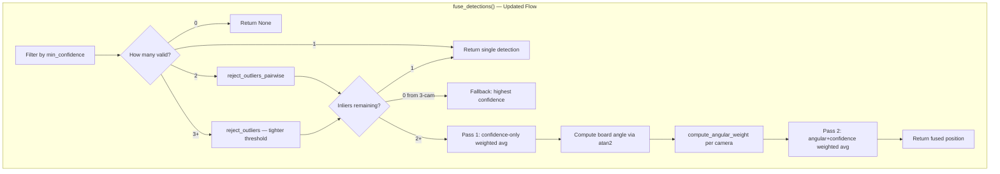

# Design Document: Fusion Accuracy Improvements

## Overview

The current `CoordinateFusion` class achieves 85.7% score accuracy (12/14 correct on Session_005). Two systematic failure modes drive the remaining errors:

1. **No 2-camera outlier rejection**: When only 2 cameras detect a throw, the current `reject_outliers()` skips rejection entirely (`if len <= 2: return all`). A single bad detection drags the fused position off-target.
2. **Equal weighting regardless of viewing angle**: All cameras contribute equally even though each camera has significantly better accuracy on its "near side" (less perspective distortion, higher effective pixel density).

This design modifies `CoordinateFusion` in-place to add pairwise outlier rejection, tighten the 3-camera threshold, and introduce angular proximity weighting via a two-pass fusion strategy. The return signature `(fused_x, fused_y, confidence, cameras_used)` is preserved — `ScoreCalculator` requires no changes.

### Key Design Decisions

- **In-place modification**: All changes are within `CoordinateFusion`. No new classes or files needed for the core logic.
- **Two-pass fusion**: Pass 1 computes a rough position with confidence-only weights. Pass 2 uses the rough position's board angle to compute angular weights and re-fuse. This avoids a chicken-and-egg problem (need position to compute angle weights, need weights to compute position).
- **Cosine falloff**: Angular weight uses `(1 + cos(Δθ)) / 2`, which gives weight 1.0 at the camera's anchor angle and 0.0 at 180° away. Smooth, no discontinuities.
- **Pairwise rejection at 20mm**: For 2-camera cases, if the two detections disagree by >20mm, the lower-confidence one is discarded. This is much tighter than the old 50mm 3-camera threshold.
- **3-camera threshold tightened to 25mm**: Down from 50mm, catching the 46mm deviation case that currently slips through.
- **Fallback on total rejection**: If all 3 detections are rejected as outliers, use the highest-confidence detection rather than returning None.

## Architecture



No new files. All changes are in `src/fusion/coordinate_fusion.py`.

## Components and Interfaces

### Updated `CoordinateFusion.__init__`

```
__init__(config):
    # Existing
    outlier_threshold_mm = config.fusion.outlier_threshold_mm  (default 25.0, was 50.0)
    min_confidence = config.fusion.min_confidence              (default 0.3)
    # New
    pairwise_rejection_mm = config.fusion.pairwise_rejection_mm  (default 20.0)
    angular_falloff = config.fusion.angular_falloff              (default 1.0)
    camera_anchors = config.fusion.camera_anchors                (default {0: 81, 1: 257, 2: 153})
    min_angular_weight = 0.1  # hardcoded floor for numerical stability
```

### Updated `fuse_detections(detections) -> (x, y, conf, cameras) | None`

Return signature unchanged. Internal flow updated:

```
fuse_detections(detections):
    1. valid = filter by min_confidence
    2. if len(valid) == 0: return None
    3. if len(valid) == 1: return single detection directly
    4. if len(valid) == 2: inliers = reject_outliers_pairwise(valid)
    5. if len(valid) >= 3: inliers = reject_outliers(valid)
       if len(inliers) == 0: inliers = [highest confidence from valid]  # fallback
    6. if len(inliers) == 1: return single detection directly
    7. Pass 1: (px, py) = compute_weighted_average(inliers)  # confidence-only
    8. board_angle = atan2(py, px)
    9. weights = {d: d.confidence * compute_angular_weight(board_angle, d.camera_id)
                  for d in inliers}
   10. if all angular weights < min_angular_weight: use confidence-only weights
   11. Pass 2: (fx, fy) = weighted average using combined weights
   12. combined_confidence = mean(d.confidence for d in inliers)
   13. return (fx, fy, combined_confidence, cameras_used)
```

### New `reject_outliers_pairwise(detections) -> list[dict]`

For exactly 2 detections:

```
reject_outliers_pairwise(detections):
    d0, d1 = detections
    dist = euclidean_distance(d0.board, d1.board)
    if dist <= pairwise_rejection_mm:
        return [d0, d1]  # both kept
    else:
        # discard lower confidence
        log rejection (camera_id, dist, threshold)
        return [d0] if d0.confidence >= d1.confidence else [d1]
```

### Updated `reject_outliers(detections) -> list[dict]`

Same median-based algorithm, but threshold is now 25mm (configurable). Added fallback behavior is handled by the caller (`fuse_detections`), not here.

```
reject_outliers(detections):
    # No longer has the "if len <= 2: return all" guard
    # (2-camera case is handled by reject_outliers_pairwise before this is called)
    median_x = median of all x coords
    median_y = median of all y coords
    inliers = [d for d in detections if distance(d, median) <= outlier_threshold_mm]
    log any rejections
    return inliers
```

### New `compute_angular_weight(board_angle_rad, camera_id) -> float`

```
compute_angular_weight(board_angle_rad, camera_id):
    anchor_deg = camera_anchors[camera_id]
    anchor_rad = radians(anchor_deg)
    delta = abs(board_angle_rad - anchor_rad)
    delta = min(delta, 2π - delta)  # shortest arc
    weight = ((1 + cos(delta)) / 2) ^ angular_falloff
    return max(weight, 0.0)
```

The `angular_falloff` exponent controls sharpness. At default 1.0, this is a pure cosine half-wave. Values >1.0 make the falloff steeper (more aggressive preference for near-side cameras).

### Updated `compute_weighted_average(detections, weights=None) -> (x, y)`

Now accepts an optional `weights` dict. If not provided, falls back to confidence-only weighting (backward compatible).

```
compute_weighted_average(detections, weights=None):
    if weights is None:
        weights = {id(d): d.confidence for d in detections}
    total_w = sum(weights.values())
    wx = sum(d.board.x * weights[id(d)] for d in detections) / total_w
    wy = sum(d.board.y * weights[id(d)] for d in detections) / total_w
    return (wx, wy)
```

## Data Models

No new data models. The detection dict format is unchanged:

```
detection = {
    "camera_id": int,
    "board": (x_mm, y_mm),
    "confidence": float  # [0, 1]
}
```

Return type from `fuse_detections()` is unchanged:

```
(fused_x: float, fused_y: float, confidence: float, cameras_used: list[int]) | None
```

### Configuration Additions to `config.toml`

```toml
[fusion]
outlier_threshold_mm = 25.0       # was 50.0 — tighter for 3-camera
pairwise_rejection_mm = 20.0      # new — for 2-camera case
min_confidence = 0.3              # unchanged
angular_falloff = 1.0             # new — cosine exponent
camera_anchors = {cam0 = 81, cam1 = 257, cam2 = 153}  # new — degrees
```


## Correctness Properties

*A property is a characteristic or behavior that should hold true across all valid executions of a system — essentially, a formal statement about what the system should do. Properties serve as the bridge between human-readable specifications and machine-verifiable correctness guarantees.*

### Property 1: Pairwise Rejection Correctness

*For any* two detections with valid confidence, if the Euclidean distance between their board positions exceeds the pairwise rejection threshold, `reject_outliers_pairwise` should return exactly one detection (the one with higher confidence). If the distance is within the threshold, it should return both detections unchanged.

**Validates: Requirements 1.1, 1.2**

### Property 2: Median-Based Outlier Rejection Correctness

*For any* set of 3 detections, `reject_outliers` should retain exactly those detections whose Euclidean distance from the median (x, y) position is ≤ the outlier threshold, and reject all others.

**Validates: Requirements 2.1**

### Property 3: Total Rejection Fallback

*For any* set of 3 detections where all are rejected by median-based outlier rejection (all > threshold from median), `fuse_detections` should return a result using the detection with the highest confidence rather than returning None.

**Validates: Requirements 2.4**

### Property 4: Angular Weight Formula

*For any* board angle and *for any* camera anchor angle, `compute_angular_weight` should return `((1 + cos(Δ)) / 2) ^ falloff` where Δ is the shortest arc between the two angles. The result should be 1.0 when the dart is at the camera's anchor angle and approach 0.0 at 180° away. The final weight for each detection should equal `confidence × angular_weight`.

**Validates: Requirements 3.2, 3.3, 3.4**

### Property 5: Two-Pass Fusion Weighted Average

*For any* set of 2+ inlier detections with positive confidence, the fused position returned by `fuse_detections` should equal the weighted average of the inlier positions using combined weights (confidence × angular_weight), where the angular weights are computed from the board angle of the confidence-only preliminary position. The return value should always be a 4-tuple `(x, y, confidence, cameras_used)` or None.

**Validates: Requirements 3.5, 4.1, 6.4**

## Error Handling

- **Zero valid detections**: If all detections are below `min_confidence`, return `None`. Same as current behavior.
- **Single detection**: Returned directly without outlier rejection or angular weighting. Same as current behavior.
- **Pairwise rejection with equal confidence**: When two detections have identical confidence and exceed the pairwise threshold, either may be kept (implementation picks the first). This is acceptable since equal confidence means neither is more trustworthy.
- **All 3 outliers rejected**: Instead of returning `None` (current behavior), fall back to the highest-confidence detection. This prevents total data loss when all cameras disagree.
- **All angular weights below 0.1**: Fall back to confidence-only weighting to avoid numerical instability from dividing by near-zero total weight.
- **Missing camera_anchors config**: Use defaults `{0: 81, 1: 257, 2: 153}` and log a warning. System continues to function.
- **Unknown camera_id not in anchors**: If a detection's camera_id has no anchor angle configured, assign angular weight 0.5 (neutral) and log a warning. This prevents crashes from unexpected camera IDs.
- **Division by zero in weighted average**: If total weight is zero (shouldn't happen given the angular weight floor and confidence filter), fall back to simple arithmetic mean of positions.

## Testing Strategy

### Unit Tests

Unit tests cover specific examples, edge cases, and configuration:

- **Pairwise rejection**: Two detections 30mm apart (> 20mm threshold) → lower confidence rejected. Two detections 15mm apart → both kept.
- **Tighter 3-camera threshold**: Three detections where one is 30mm from median (> 25mm) → rejected. Same scenario at old 50mm threshold would have passed.
- **Total rejection fallback**: Three detections all >25mm from median → highest confidence returned instead of None.
- **Angular weight at known angles**: cam0 anchor=81°, dart at 81° → weight=1.0. Dart at 261° (180° away) → weight≈0.0. Dart at 171° (90° away) → weight=0.5.
- **Two-pass fusion**: Verify pass 1 uses confidence-only, pass 2 uses angular+confidence weights.
- **Backward compatibility**: Old config (no new keys) → defaults applied, fusion works.
- **Default config values**: Verify pairwise_rejection_mm=20.0, outlier_threshold_mm=25.0, angular_falloff=1.0, camera_anchors defaults.
- **Return type preservation**: Verify `fuse_detections()` returns `(float, float, float, list[int]) | None`.
- **Angular weight fallback**: All cameras far from dart angle (all weights < 0.1) → confidence-only weighting used.

### Property-Based Tests

Property-based tests use the `hypothesis` library with a minimum of 100 iterations per test. Each test references its design property.

- **Property 1 test**: Generate random pairs of detections with random positions and confidences. Compute pairwise distance. Verify: if distance > threshold, only higher-confidence detection survives; if distance ≤ threshold, both survive.
  Tag: `Feature: step-7.1-fusion-accuracy, Property 1: Pairwise Rejection Correctness`

- **Property 2 test**: Generate 3 random detections. Compute median position. Verify retained detections are exactly those within threshold of median.
  Tag: `Feature: step-7.1-fusion-accuracy, Property 2: Median-Based Outlier Rejection Correctness`

- **Property 3 test**: Generate 3 detections that are all far apart (all > threshold from median). Verify `fuse_detections` returns a non-None result using the highest-confidence detection's position.
  Tag: `Feature: step-7.1-fusion-accuracy, Property 3: Total Rejection Fallback`

- **Property 4 test**: Generate random board angles and camera IDs. Verify `compute_angular_weight` matches `((1 + cos(shortest_arc)) / 2) ^ falloff`. Verify final weight = confidence × angular_weight.
  Tag: `Feature: step-7.1-fusion-accuracy, Property 4: Angular Weight Formula`

- **Property 5 test**: Generate 2-3 close detections (within threshold). Compute expected two-pass result manually: pass 1 confidence-only average → board angle → angular weights → pass 2 weighted average. Verify `fuse_detections` output matches within tolerance.
  Tag: `Feature: step-7.1-fusion-accuracy, Property 5: Two-Pass Fusion Weighted Average`

### Test Configuration

- Library: `hypothesis` (Python property-based testing)
- Minimum iterations: 100 per property test (`@settings(max_examples=100)`)
- Each property test tagged with a comment referencing the design property
- Tests located in `tests/test_fusion_accuracy_properties.py`
- Unit tests in `tests/test_fusion_accuracy.py`
