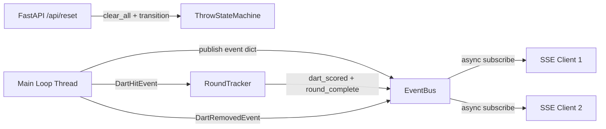

# Design Document: Step 9 — Web API (SSE)

## Overview

This design adds a minimal HTTP API layer to the ARU-DART backend, bridging the existing `ThrowStateMachine` event stream to connected clients (a Flutter dart training app on the same LAN) via Server-Sent Events (SSE). The API runs as a FastAPI server in a daemon thread alongside the main camera/detection loop, communicating through a thread-safe event bus.

The system has three new modules:

- **EventBus** — thread-safe bridge: sync `publish()` from the main loop, async `subscribe()` for FastAPI handlers
- **RoundTracker** — accumulates `dart_scored` events within a round, emits `round_complete` when 3 darts are scored
- **Server** — FastAPI app with SSE streaming endpoint and reset endpoint



## Architecture

### Threading Model

The main process has two threads:

1. **Main thread** — camera capture, motion detection, state machine processing (synchronous, uses `threading`)
2. **API thread** — FastAPI/uvicorn server (async, uses `asyncio`)

The EventBus bridges these two worlds: `publish()` is a plain synchronous call that puts a dict onto an internal collection; `subscribe()` returns an async generator that yields events from a per-client `asyncio.Queue`.

### Event Flow

```
ThrowStateMachine.process()
  → returns [DartHitEvent | DartRemovedEvent | ...]
  → main loop passes DartHitEvent to RoundTracker
  → RoundTracker emits dart_scored dict (always) + round_complete dict (when dart_number == 3)
  → main loop publishes emitted dicts to EventBus
  → main loop publishes darts_removed dict on DartRemovedEvent (count_remaining == 0)
  → EventBus fans out to all subscriber queues
  → SSE endpoint yields each dict as an SSE frame
```

### Module Structure

```
src/api/
├── __init__.py
├── server.py          # FastAPI app, SSE endpoint, reset endpoint
├── event_bus.py       # Thread-safe event bus (sync publish, async consume)
└── round_tracker.py   # Tracks darts per round, emits round_complete
```

## Components and Interfaces

### EventBus (`src/api/event_bus.py`)

Thread-safe pub/sub bridge between the sync main loop and async FastAPI handlers.

```
class EventBus:
    publish(event: dict) -> None
        # Called from main loop thread. Non-blocking.
        # Puts event into every subscriber's asyncio.Queue via loop.call_soon_threadsafe.

    subscribe() -> AsyncGenerator[dict, None]
        # Called from SSE handler. Yields events as they arrive.
        # Creates a per-client asyncio.Queue on entry, removes on exit.

    subscriber_count -> int
        # Number of currently connected subscribers.
```

Internal state:
- `_subscribers: list[asyncio.Queue]` — one queue per connected SSE client
- `_loop: asyncio.AbstractEventLoop | None` — set when the FastAPI server starts, used by `publish()` to call `loop.call_soon_threadsafe`

When `publish()` is called and `_loop` is None or there are no subscribers, the event is silently dropped (requirement 6.3: don't block main loop).

### RoundTracker (`src/api/round_tracker.py`)

Stateful tracker that converts raw `DartHitEvent` objects into `dart_scored` and `round_complete` SSE event dicts.

```
class RoundTracker:
    process_hit(dart_hit: DartHitEvent) -> list[dict]
        # Returns [dart_scored_dict] or [dart_scored_dict, round_complete_dict]
        # Increments internal dart counter (1→2→3)
        # When counter reaches 3, appends round_complete with all 3 throws + total

    reset() -> None
        # Clears accumulated throws and resets counter to 0

    dart_count -> int
        # Current number of darts in this round (0, 1, 2, or 3)
```

Score label conversion reuses the pattern from `score_to_display_string` in `src/feedback/feedback_collector.py`, but returns just the label (e.g. `"T20"`) without the points suffix.

### FastAPI Server (`src/api/server.py`)

```
create_app(event_bus: EventBus, state_machine: ThrowStateMachine | None) -> FastAPI
    # Factory that creates the FastAPI app with routes bound to the given instances

GET /api/events -> StreamingResponse (text/event-stream)
    # SSE endpoint. Async generator subscribes to event_bus.
    # Sends keepalive comment every 15s if no events.
    # Each event: "event: {event_type}\ndata: {json_payload}\n\n"

POST /api/reset -> JSONResponse
    # Calls state_machine.dart_tracker.clear_all()
    # Transitions state_machine to WaitForThrow
    # Returns {"status": "ok", "message": "System reset"}
    # Returns 503 if state_machine is None

start_server(app: FastAPI, host: str, port: int) -> None
    # Runs uvicorn in a daemon thread
```

### SSE Wire Format

Each SSE frame follows the standard format:

```
event: dart_scored
data: {"dart_number": 1, "label": "T20", "points": 60}

event: round_complete
data: {"throws": [{"dart_number": 1, "label": "T20", "points": 60}, ...], "total": 100}

event: darts_removed
data: {"message": "Ready for next round"}
```

Keepalive (sent every ≤15s when idle):
```
: keepalive

```

## Data Models

### SSE Event Payloads

**dart_scored:**
```json
{
  "dart_number": 1,
  "label": "T20",
  "points": 60
}
```

**round_complete:**
```json
{
  "throws": [
    {"dart_number": 1, "label": "T20", "points": 60},
    {"dart_number": 2, "label": "S5", "points": 5},
    {"dart_number": 3, "label": "DB", "points": 50}
  ],
  "total": 115
}
```

**darts_removed:**
```json
{
  "message": "Ready for next round"
}
```

### Score Label Mapping

| Ring          | Format     | Example |
|---------------|------------|---------|
| triple        | T{sector}  | T20     |
| double        | D{sector}  | D16     |
| single        | S{sector}  | S5      |
| single_bull   | SB         | SB      |
| bull          | DB         | DB      |
| miss          | Miss       | Miss    |


## Correctness Properties

*A property is a characteristic or behavior that should hold true across all valid executions of a system — essentially, a formal statement about what the system should do. Properties serve as the bridge between human-readable specifications and machine-verifiable correctness guarantees.*

### Property 1: Fan-out delivery

*For any* event published to the EventBus and *for any* number of currently subscribed clients (1 or more), every subscriber should receive exactly that event.

**Validates: Requirements 1.3, 6.2**

### Property 2: Subscriber disconnect isolation

*For any* set of subscribers, when one subscriber is removed, all remaining subscribers should continue to receive subsequently published events without loss.

**Validates: Requirements 1.4**

### Property 3: dart_scored payload correctness

*For any* valid `DartHitEvent` (with any ring type, sector, and total), when processed by `RoundTracker.process_hit()`, the resulting `dart_scored` dict must contain `dart_number` (int 1–3), `label` (string matching the score label format: `T{sector}`, `D{sector}`, `S{sector}`, `SB`, `DB`, or `Miss`), and `points` (int equal to `score.total`).

**Validates: Requirements 2.1, 2.2, 2.4**

### Property 4: Sequential dart numbering

*For any* sequence of `DartHitEvent` objects processed by a fresh `RoundTracker`, the `dart_number` in successive `dart_scored` outputs must be 1, 2, 3 in order, resetting after a `reset()` call.

**Validates: Requirements 2.5**

### Property 5: Round completion ordering and emission

*For any* sequence of exactly 3 `DartHitEvent` objects processed by a fresh `RoundTracker`, the 3rd call to `process_hit()` must return a list where `dart_scored` appears before `round_complete`, and the first two calls must not produce a `round_complete` event.

**Validates: Requirements 2.3, 3.1**

### Property 6: round_complete payload correctness

*For any* 3 valid `DartHitEvent` objects processed by a fresh `RoundTracker`, the `round_complete` dict must contain a `throws` array with exactly 3 entries in input order (each with `dart_number`, `label`, `points`), and a `total` field equal to the sum of the 3 individual `points` values.

**Validates: Requirements 3.2, 3.3, 3.4**

### Property 7: darts_removed event generation

*For any* `DartRemovedEvent` with `count_remaining == 0`, the conversion to an SSE event dict must produce `{"event": "darts_removed", "message": "Ready for next round"}`. For any `DartRemovedEvent` with `count_remaining > 0`, no `darts_removed` event should be produced.

**Validates: Requirements 4.1, 4.2**

### Property 8: Reset restores initial state

*For any* `ThrowStateMachine` in any state with any number of tracked darts, calling the reset logic must result in `current_state == State.WaitForThrow` and `dart_tracker.get_total_dart_count() == 0`.

**Validates: Requirements 5.2**

### Property 9: No replay of past events

*For any* sequence of events published to the EventBus before a new subscriber connects, that subscriber must receive none of those prior events. Only events published after subscription should be delivered.

**Validates: Requirements 6.4**

## Error Handling

| Scenario | Behavior |
|---|---|
| SSE client disconnects mid-stream | `subscribe()` generator catches `asyncio.CancelledError`, removes client queue from `_subscribers`, logs disconnect |
| `publish()` called before event loop set | Event silently dropped (no subscribers yet) |
| `publish()` called with no subscribers | No-op, non-blocking |
| `POST /api/reset` with no state machine | Return HTTP 503 `{"status": "error", "message": "State machine not available"}` |
| Malformed event dict published | Logged as warning, skipped (not forwarded to subscribers) |
| Subscriber queue full (backpressure) | Use `maxsize` on asyncio.Queue; if full, drop oldest event and log warning |

## Testing Strategy

### Property-Based Testing

Use **Hypothesis** (already in use in this project) for property-based tests. Each property test runs a minimum of 100 iterations.

Tests target the pure logic components that don't require async infrastructure:

- **RoundTracker properties** (Properties 3, 4, 5, 6): Generate random `DartHitEvent` objects with varied Score values (all ring types, sectors 1–20, bulls, misses). Verify payload structure, label format, dart numbering, ordering, and round_complete totals.
- **EventBus fan-out properties** (Properties 1, 2, 9): Use `asyncio.run()` in tests to exercise the async subscribe/publish cycle with random event counts and subscriber counts.
- **darts_removed conversion** (Property 7): Generate random `DartRemovedEvent` objects with varied `count_remaining` values.
- **Reset property** (Property 8): Generate random state machine states and dart counts, call reset, verify postconditions.

Each property test must be tagged with a comment:
```python
# Feature: step-9-web-api, Property 3: dart_scored payload correctness
```

### Unit Tests

Unit tests cover specific examples, edge cases, and integration points:

- SSE endpoint returns `text/event-stream` content type (Req 1.1)
- Keepalive sent within 15s of no events (Req 1.5)
- `POST /api/reset` returns 200 with correct JSON (Req 5.3)
- `POST /api/reset` returns 503 when state machine is None (Req 5.4)
- RoundTracker `reset()` clears state after partial round
- RoundTracker handles fewer than 3 darts when round_complete is forced (edge case, Req 3.5)
- Score label edge cases: all 6 ring types produce correct labels

### Test Configuration

- Property tests: minimum 100 iterations via `@settings(max_examples=100)`
- Use `httpx.AsyncClient` with FastAPI's `TestClient` for endpoint tests
- Use `pytest-asyncio` for async test functions
- No external services required — all tests are self-contained
